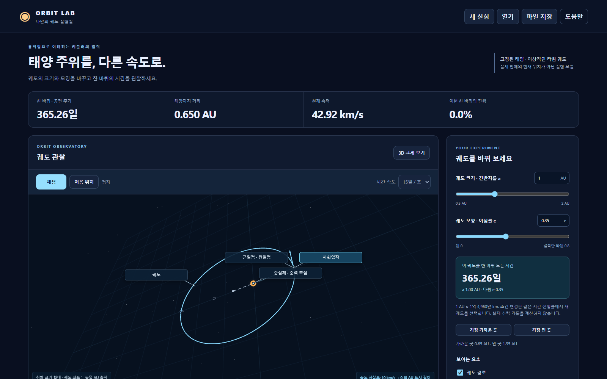

# Orbit Lab

고정된 태양 주위의 이상적인 원·타원 궤도를 관찰하는 한국어 실험 앱입니다. 긴반지름과 이심률을 바꾸고, 같은 시간 배율에서 공전 속력·주기·쓸린 면적의 관계를 살펴봅니다.

1.1은 원·타원 궤도의 관계를 직접 관찰하는 교육용 앱입니다. 설치 파일과 각 버전의 실제 검사 범위는 [릴리스 안내](https://github.com/Ulsancl/orbit-lab/releases/latest)에서 확인하세요. 수치·화면 검사는 외부 사용자 연구나 판매 적합성 인증을 뜻하지 않습니다.



## 관찰할 수 있는 것

- 0.5~2 AU의 긴반지름, 0~0.8의 이심률과 한 주기의 공전 위치.
- 태양 초점, 타원 중심·다른 초점, 긴반지름, 반지름 선, 근일점·원일점과 속도 벡터.
- 공통 시간 배율: 화면 1초가 모형 5·15·30일. 큰 궤도는 화면에서도 더 천천히 한 바퀴를 돕니다.
- 한 궤도의 두 같은 시간 구간에 해당하는 곡선 면적과 해석식 면적.
- 고정한 비교 궤도·위치와 현재 조건의 속력 및 주기 그래프. 두 궤도는 같은 AU 공간 축을 사용합니다.
- 조건·공전 위치·비교·표시 상태·시점·배율을 담는 `.orbit.json` 파일과 브라우저 자동 저장.

1.1.0에서는 방사·횡방향 속도와 태양 방향 가속도, 평균각 M·보조원각 E·실제 위치각 ν를 함께 읽습니다. 임시 구성보기에서 벡터 합과 각도 기준점을 확인하고 원래 카메라로 돌아갈 수 있습니다. 단위 질량당 에너지·각운동량과 근일점·원일점까지의 시간도 [상세 계측](docs/detail-refinement.md)에서 설명합니다.

## 처음 관찰하기

1. 실험 안내에서 주기, 속력 또는 같은 시간·같은 면적을 선택합니다.
2. 안내 조건을 실제로 맞추고 관찰 확인을 눌러 수치를 기록합니다. 읽기만 하거나 시간이 흐르는 것으로 안내가 완료되지는 않습니다.
3. 자유 탐구에서는 3D 위의 재생·일시정지와 시간 속도를 사용합니다. 긴반지름·이심률 변경은 현재 공전 진행률에서 새 이상 궤도를 선택하며, 실제 추력 기동을 뜻하지 않습니다.
4. 비교 보관 후 다른 조건을 선택합니다. 보관한 위치는 스스로 움직이지 않습니다. 그래프의 `t/T`는 각 궤도 주기로 나눈 진행률이므로 서로 같은 경과 일수가 아닙니다.

카메라 회전·확대와 대상 선택은 물리 조건을 바꾸지 않습니다. 대상에 가까이 보기는 명시적으로 시점을 옮깁니다. 파일을 열거나 앱을 다시 시작하면 정지 상태로 관찰을 복원합니다.

## 모형의 범위

질량을 무시한 입자 하나, 고정 태양, 한 평면의 결합 케플러 궤도입니다. 실제 날짜의 천체 위치, 다체 상호작용, 충돌, 추력, 전이 궤도, 탈출을 계산하지 않습니다. 태양·입자 구체는 알아보기 쉽게 확대된 기호이며 표면이나 빛 번짐은 충돌 경계가 아닙니다. 원궤도의 기준·반대 위치는 유일한 근일점·원일점이 아닙니다.

내부 계산은 SI 단위를 사용하고 화면의 거리·속력·시간은 AU, km/s, 일로 환산합니다. 화면의 현재 주기 시간은 이번 주기 안의 위치이며 누적 여행 시간이 아닙니다. 속도 화살표는 1 km/s당 0.01 AU의 고정 표시 길이를 사용합니다.

## 개발 및 실행

Node.js 24.19와 Windows x64 환경을 기준으로 준비합니다.

```sh
npm ci
npm test
npm run dev
npm run build
npm run test:browser
npm run test:consumer
npm run test:consumer-acceptance
npm run test:detail
npm run desktop
npm run test:desktop
npm run package:desktop
```

개발 서버는 `127.0.0.1:5250`, 브라우저 검사는 `127.0.0.1:5251`을 사용하며 포트가 사용 중이면 새 서버 시작을 중단합니다. 위 명령 목록은 검사 결과를 의미하지 않습니다. 브라우저·네이티브 검사는 각각 별도로 실행합니다.

Windows 설치 파일은 `release/windows/Orbit-Lab-Setup-1.1.0.exe`와 SHA-256 sidecar로 생성됩니다. 코드 서명과 자동 업데이트는 포함하지 않습니다. 브라우저·소스/패키지 네이티브 검사를 Windows CI에서 순차 실행하며, 실제 설치·업데이트와 실행 환경은 각 릴리스의 결과 기록에 별도로 남깁니다. [배포 안내](docs/distribution.md)에 설치와 자료 보존 범위를 정리했습니다.

[저장 방식](docs/storage.md) · [모형](docs/model.md) · [시각 요소](docs/anatomy.md) · [원리 출처](docs/references.md) · [개인정보](docs/privacy.md) · [문제 보고](docs/support.md) · [제3자 고지](docs/THIRD-PARTY-NOTICES.md)

자체 코드와 원본 자산은 UNLICENSED입니다. 별도 허락 없이 재배포·판매할 수 있는 공개 라이선스를 부여하지 않습니다. 제3자 구성 요소에는 각자의 라이선스가 적용됩니다.
